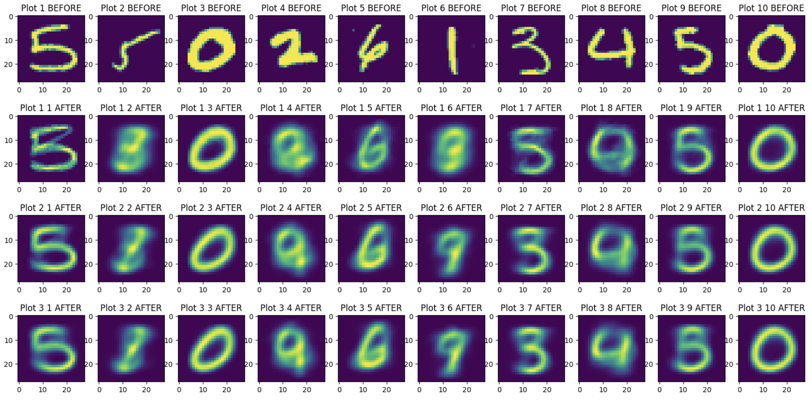

# 4022-Project

<div align="center">
    
</div>

Digit classification with K-Means clustering

Main code file is ```research/main.ipynb```

### Environment Setup 
```
python3 -m venv venv
source venv/bin/activate
pip install -r requirements.txt
```

###  Write-Up

The complete project write up is compiled in a PDF format. You can access it by clicking the link below:

[Write Up PDF](./assets/WriteUp.pdf)

### Presentation

Slides: https://docs.google.com/presentation/d/1LgfTgp0mLIOAv0NgphH1Dabi6m-mlunv26zONNy2kFc/edit#slide=id.p
