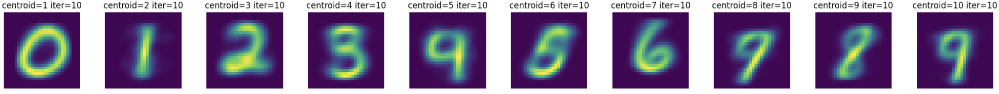
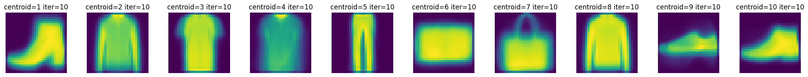

# Centroids Visualizations as Internal Representations of Image Data

<div align="center">
    
    
</div>

### Summary

Think of a green apple.

Now think of a fluffy kitten.

As you were imagining these, you might have noticed that you have internal ‘representations’ of various objects and concepts. Can we create an algorithm that has internal representations of handwritten digits and fashion items? We find that with a large amount of image data then k-means clustering’s centroids, when plotted, resemble the most common item assigned to the cluster and will be an identifiable representation of the datasets classes.

### Code
Main code file is ```research/main.ipynb```

### Environment Setup 
```
python3 -m venv venv
source venv/bin/activate
pip install -r requirements.txt
```

###  Write-Up

The complete project write up is compiled in a PDF format as well as a Google Doc. You can access either of these by clicking the link below:

[Write-up PDF](./assets/4022%20Project%20Write-up.pdf) | [Write-up Link](https://docs.google.com/document/d/1jfs_Y3a3PV33UePfLRl7O0zu-oGrzLDcF12To9LohM0/edit?usp=sharing)

### Presentation

[Presentation slides](https://docs.google.com/presentation/d/1LgfTgp0mLIOAv0NgphH1Dabi6m-mlunv26zONNy2kFc/edit?usp=sharing)
